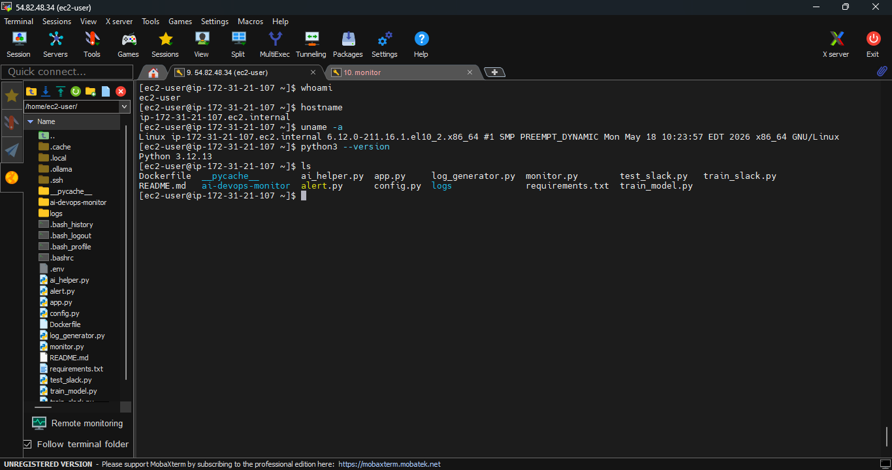
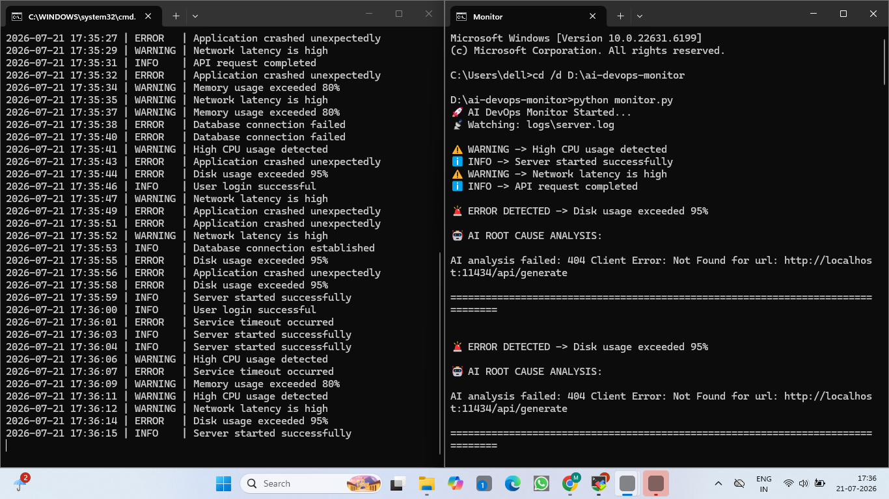
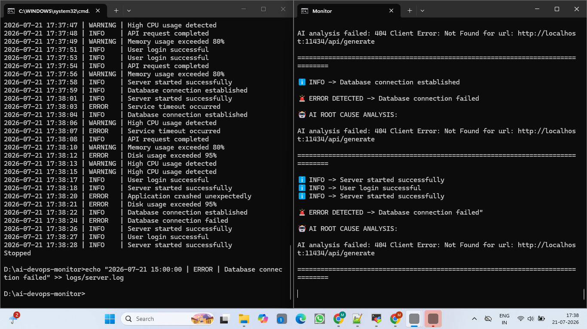
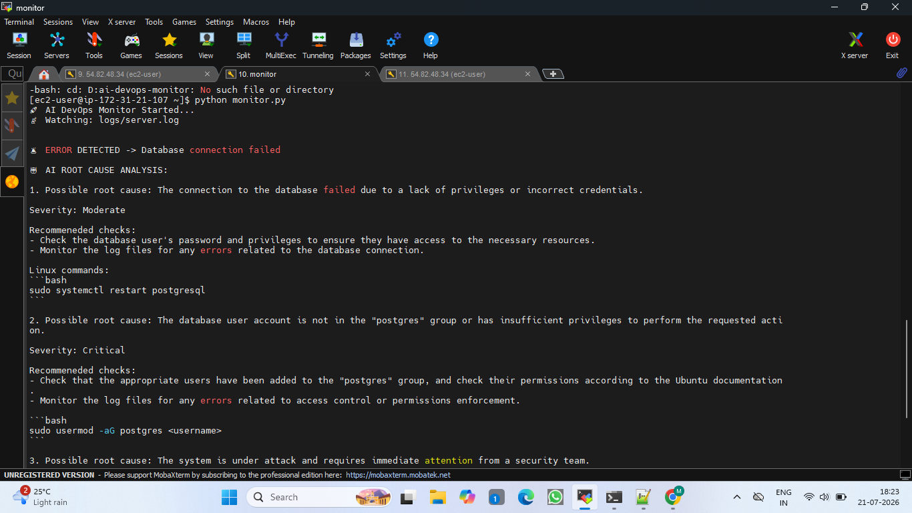

# 🚀 AI DevOps Monitor

An AI-powered DevOps monitoring system that detects application failures, performs LLM-based root cause analysis, and sends real-time Slack alerts.

---

# 📌 Project Overview

Modern applications generate thousands of logs every day. Manually monitoring and analyzing these logs can delay incident response.

The **AI DevOps Monitor** automates incident detection by:

* Monitoring application logs in real time
* Detecting critical errors automatically
* Performing AI-based root cause analysis
* Sending instant Slack notifications
* Running on AWS EC2 Linux environments

This project demonstrates the integration of **DevOps automation, Cloud infrastructure, Linux administration, and Generative AI**.

---

# 🎯 Project Objectives

The main objectives of this project are:

* Build a real-time log monitoring solution
* Reduce manual troubleshooting effort
* Detect application failures automatically
* Generate intelligent troubleshooting suggestions
* Improve incident response time

---

# 🏗️ Architecture

```
              Application Logs
                    |
                    |
                    v

            +---------------+
            |  monitor.py   |
            | Log Monitoring |
            +---------------+

                    |
                    |
              Error Detection

                    |
                    v

            +---------------+
            | ai_helper.py  |
            |  Ollama LLM   |
            | Root Cause AI |
            +---------------+

                    |
                    |
              AI Analysis

                    |
                    v

            +---------------+
            |   alert.py    |
            | Slack Webhook |
            +---------------+

                    |
                    v

              Slack Channel
```

Architecture Diagram:


---

# ✨ Features

## 🔍 Real-Time Log Monitoring

* Continuously watches application log files
* Detects new log events automatically
* Processes failures in real time

## 🚨 Automated Error Detection

The system detects:

* ERROR events
* Critical failures
* Database connection issues
* Service failures

Example:

```
2026-07-21 ERROR | Database connection failed
```

## 🤖 AI-Powered Root Cause Analysis

The AI module analyzes detected errors and provides:

* Possible root cause
* Severity level
* Recommended checks
* Linux troubleshooting commands

Example:

```
Possible Root Cause:
Database service unavailable

Severity:
High

Recommended Checks:

systemctl status mysql

journalctl -xe
```

## 🔔 Slack Alert Integration

Automatically sends incident notifications containing:

* Error details
* AI analysis
* Recommended actions

## ☁️ AWS Deployment

The application was deployed and tested on:

* AWS EC2
* Linux environment

---

# 🛠️ Tech Stack

| Category             | Technology            |
| -------------------- | --------------------- |
| Programming Language | Python 3              |
| Cloud Platform       | AWS EC2               |
| Operating System     | Linux                 |
| AI Model             | Ollama                |
| Monitoring           | Python Log Monitoring |
| Notifications        | Slack Webhook         |
| Version Control      | Git & GitHub          |
| Containerization     | Docker                |

---

# 📂 Project Structure

```
AI-DevOps-Monitor/

│
├── monitor.py
├── ai_helper.py
├── alert.py
├── log_generator.py
├── config.py
│
├── logs/
│   └── server.log
│
├── screenshots/
│   ├── architecture.png
│   ├── ec2-deployment.png
│   ├── monitor-running.png
│   ├── error-detection.png
│   ├── ai-analysis.png
│   └── slack-alert.png
│
├── requirements.txt
├── Dockerfile
├── .env.example
├── LICENSE
└── README.md
```

---

# ⚙️ Installation

## Clone Repository

```bash
git clone https://github.com/YOUR_USERNAME/AI-DevOps-Monitor.git

cd AI-DevOps-Monitor
```

---

## Create Virtual Environment

```bash
python3 -m venv venv

source venv/bin/activate
```

---

## Install Dependencies

```bash
pip install -r requirements.txt
```

---

# 🔐 Environment Configuration

Create a `.env` file:

```env
SLACK_WEBHOOK_URL=your_slack_webhook_url
```

⚠️ Do not upload your actual `.env` file to GitHub.

---

# 🤖 Ollama Setup

Install Ollama:

```bash
curl -fsSL https://ollama.com/install.sh | sh
```

Download AI model:

```bash
ollama pull tinyllama
```

Start Ollama:

```bash
ollama serve
```

---

# ▶️ Running the Project

## Start Log Generator

```bash
python3 log_generator.py
```

## Start Monitoring System

```bash
python3 monitor.py
```

Expected Output:

```
🚀 AI DevOps Monitor Started...

📡 Watching logs/server.log

🚨 ERROR DETECTED

🤖 AI ROOT CAUSE ANALYSIS
```

---

# ☁️ AWS EC2 Deployment

Deployment steps:

1. Launch AWS EC2 instance
2. Connect using SSH
3. Install Python dependencies
4. Configure environment variables
5. Deploy monitoring application
6. Test error detection workflow

EC2 Deployment Screenshot:



---

# 📸 Project Screenshots

## Monitoring System



## Error Detection



## AI Root Cause Analysis



## Slack Notification


---

# 🧩 Challenges & Solutions

## Linux Environment Setup

Worked on:

* Python environment configuration
* Linux package installation
* Service troubleshooting
* Permission management

## AI Model Deployment Challenge

While deploying the LLM model on a small EC2 instance:

* Model loading failed because of limited memory
* Linux OOM killer terminated the process

Key Learning:

* Infrastructure sizing is important for AI workloads
* Cloud resources should match application requirements

---

# 🚀 Future Enhancements

Planned improvements:

* Docker container deployment
* Kubernetes deployment
* Prometheus monitoring
* Grafana dashboards
* Multi-server monitoring
* Email/SMS notifications
* Automated remediation workflows
* Cloud-hosted AI model integration

---

# 📈 Skills Demonstrated

This project demonstrates hands-on experience with:

✅ AWS EC2
✅ Linux Administration
✅ Python Automation
✅ Git & GitHub
✅ DevOps Monitoring
✅ Slack Integration
✅ Generative AI Integration
✅ Troubleshooting Production-like Issues

---

# 👩‍💻 Author

## Mayuri Ambare

Cloud & DevOps Engineer

Skills:

* AWS
* Linux
* Docker
* Jenkins
* Terraform
* Kubernetes
* Python
* DevOps Automation
* Generative AI

LinkedIn:
https://www.linkedin.com/in/mayuriambare

GitHub:
https://github.com/mayuriii-13

---

⭐ If you find this project useful, consider giving it a star!
